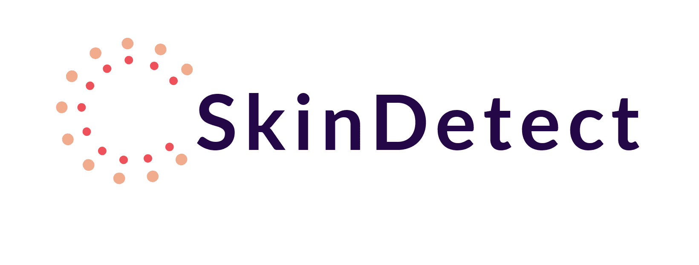
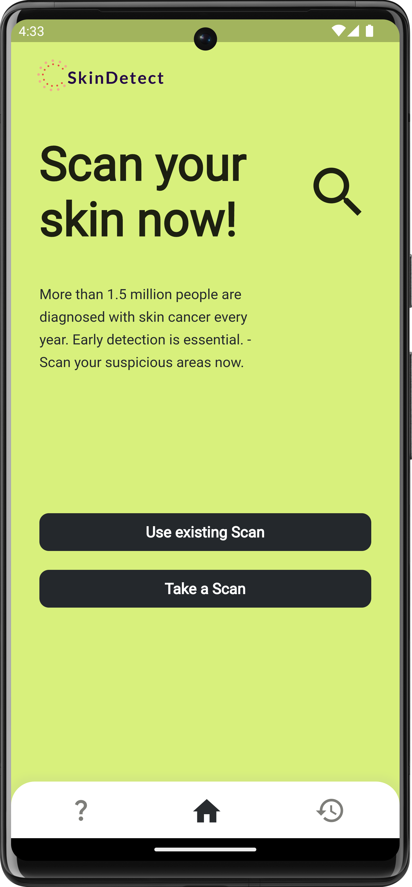
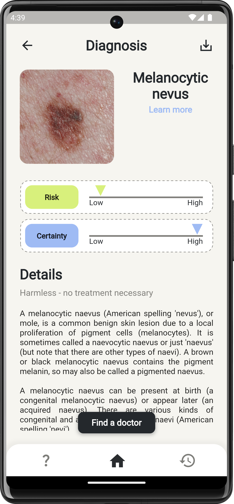
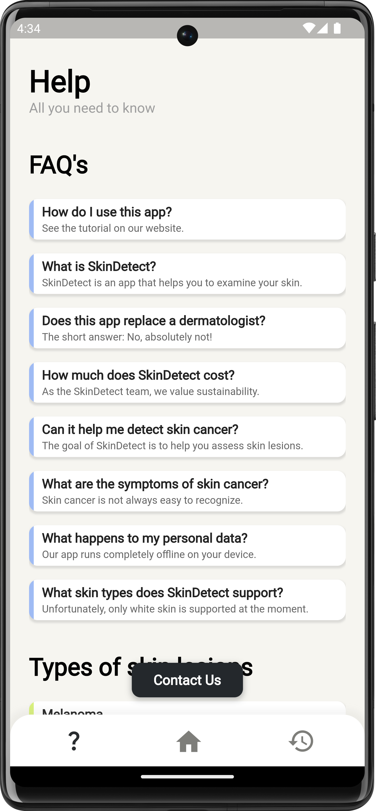

# SkinDetect

    
    
SkinDetect is an app created to diagnose skin lesions, including the most widespread types of skin cancer, via its custom-trained AI. This is the repository for the second version of the app, developed with Flutter and Tensorflow.

## About SkinDetect

SkinDetect is an app that uses artificial intelligence to recognize eight different types of skin
lesions. The app can detect various types of skin lesions, ranging from dangerous skin cancers like
basal cell carcinoma (BCC), the most common form of skin cancer, to harmless lesions like normal
moles (melanocytic nevi). The following 8 lesion types can be detected by SkinDetect:

- Actinic keratoses (akiec)
- Basal cell carcinoma (bcc)
- Benign keratosis-like lesions (bkl)
- Dermatofibroma (df)
- Melanoma (mel)
- Melanocytic nevi (nv)
- Vascular lesions (vasc)
- Squamous cell carcinoma (scc)

For more information about the different skin lesion types refer to the help section in the app
where all types are explained in detail.

## Motivation

The SkinDetect app was developed to contribute to the 17 Sustainable Development Goals established
by the United Nations. Specifically, this app strives to support the aim to limit diseases all
around the world, which was formulated under development goal number 3: "good health and well-being"
.

Skin cancer is widespread, and more than 1.5 million people worldwide are affected by it every year.
Studies from the USA illustrate the prevalence after they came to the prediction that,
statistically, every fifth American will get skin cancer once in his life. However, the chance of
survival is high thanks to medical advances. For black skin cancer, for example,
studies suggest that the 5-year survival rate is 99% if the cancer has not yet spread to the lymph
nodes. If the cancer has already spread and hit nearby lymph nodes, the likelihood of survival drops
to only 68%. If distant lymph nodes and organs are affected, the risk is as low as 30%. These
research results show that early and accurate detection is essential for
survival ([American Academy of Dermatolgy Association, 2022](https://www.aad.org/media/stats-skin-cancer))
.

To support this early and accurate detection, we developed this app to help dermatologists with
their diagnosis and give people without a medical background the chance to make an assessment about
their skin lesions.

## Cost of this app

We made the SkinDetect app completely free so that anyone, regardless of income, could use it. The
only requirement is that you have a smartphone capable of running this app and a lens attachment for
your camera. All devices with Android 4.4 (and above) or iOS 11 (and above) are supported.

## Privacy protection

As this app handles sensitive information about your health, we put a great emphasis on the
protection of your data. That's why we implemented a "privacy by design" model. By default, no data
from your skin lesion scans is saved. Not locally nor in the cloud. However, if you wish to save a
diagnosis, it is possible to do so. The scan will then be encrypted and saved locally on your
device. On Apple devices, KeyChain is used for the encryption. On Android devices, AES is used with
the AES secret key being encrypted with RSA and stored in your Keystore.

## SkinDetects AI

For this second version of SkinDetect, the AI has been completely redeveloped from the ground up.
The
AI was trained on over 25 000 images from
the [ISIC 2019 dataset](https://challenge.isic-archive.com/landing/2019/) using
the [EfficientNetV2M](https://www.tensorflow.org/api_docs/python/tf/keras/applications/efficientnet_v2/EfficientNetV2M)
architecture. Overall, the model achieved an accuracy of around 89% evaluated via 5-fold
cross-validation. All metrics evaluated via 5-fold cross-validation can be seen below:

- Average validation loss: 0.495 (Standard deviation of 3.67%)
- Average validation accuracy: 88.96% (Standard deviation of 0.36%)
- Average validation F1-Score: 88.82% (Standard deviation of 0.37%)
- Average validation precision: 89.43% (Standard deviation of 0.35%)
- Average validation recall: 88.69% (Standard deviation of 0.36%)

For more in-depth information, refer to the Google Colab Notebook where the AI was
trained [here](https://colab.research.google.com/drive/1mg9DSqIsEkWc1mC333MlAA-MWaXnKeb4?usp=sharing)
.

## Getting started

After installing the app, the home screen is presented. On this screen, you can take a new scan or
use an existing one for the diagnosis.

    

 

Once the SkinDetect AI has evaluated your skin lesion, the diagnosis is presented to you. Here you
can get information about the type of diagnosed lesion, its risk, and the certainty of the AI.
Additionally, you can find a doctor near you if desired. If you wish to, you can save your scan on
the top right and access it in your history on the bottom right any time later.

    

 

For an in-depth tutorial on how to use this app, refer to the FAQ section in the app. Here many
relevant questions will be answered and the different types of skin lesions are explained
extensively.

    

## Getting the app

As releasing medical apps comes with many hurdles relating to regulatory approval and legal
safeguards for us developers, the SkinDetect app is unfortunately not available for download at the
moment. To test the app during development, the latest version for Android can be
downloaded [here](latest_app_version/).
This version is only meant to be used by the developers of this app and is not a released version
for the public.

## Developed by

- Dennis Klaus &ensp;

- Maximilian Zimmermann &ensp;

